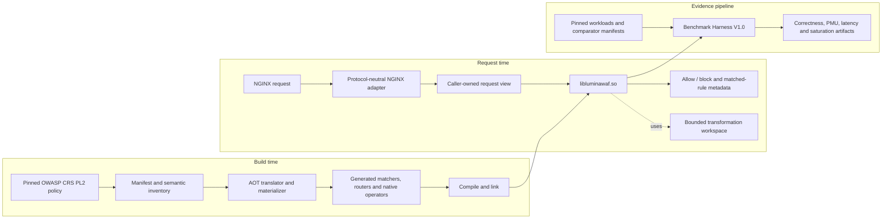

# LuminaWAF

**An experimental AOT-compiled, SIMD-oriented Web Application Firewall engine for NGINX.**

LuminaWAF explores a simple question:

> How much of OWASP Core Rule Set inspection can be moved out of a dynamic, regex-heavy runtime and compiled into a bounded native dataplane?

LuminaWAF translates the supported semantics of a pinned inbound OWASP Core Rule Set paranoia level 2 policy into native execution units.

The production request path does not parse CRS rule files, load a regular-expression engine or dynamically resolve an external SQL injection classifier.

The current release line is `v0.4.x`.

> [!WARNING]
> LuminaWAF is a systems-engineering research prototype and portfolio project.
>
> It is **not** an audited, production-ready replacement for ModSecurity.

## TL;DR for Reviewers

Start here:

1. **What it is:** LuminaWAF AOT-compiles the supported semantics of a pinned inbound OWASP CRS
   PL2 policy into a native NGINX inspection dataplane.
2. **Headline evidence:** `99.75%` correctness agreement across 3,986 tests in the pinned CRS PL2
   regression gate, `55.47 us` direct allow-transaction CPU and `9,570.88` sustainable
   single-worker RPS in the canonical run. These are different measurement boundaries.
3. **Architecture:** read [Runtime Design](#runtime-design) and
   [Execution Model](#execution-model).
4. **Methodology:** start with [Reproducible Benchmark](#reproducible-benchmark), then use the
   normative [V1.0 Protocol](methodology/README.md).
5. **Canonical evidence:** inspect the [published evidence bundle](reports/canonical/v0.4.0-rc.11/)
   and its [raw artifact index](reports/canonical/v0.4.0-rc.11/RAW/README.md).
6. **Languages:** the inspection core and NGINX adapter are C/C++; Python is used for build-time
   translation, generators, tests and benchmark orchestration.

I built it independently over several months, mostly because I enjoy going one layer lower than is probably reasonable.

Sometimes the best reason to build something is simply:

> **Make cool shit and learn what breaks.**

---

## What LuminaWAF Is

LuminaWAF consists of:

* a build-time policy translator and materializer;
* generated native execution units;
* a bounded request-inspection runtime;
* an NGINX dynamic module;
* a correctness and performance evidence pipeline.

Instead of interpreting rule files on every request, LuminaWAF freezes a supported policy at build time and translates it into:

* generated finite-state matchers;
* compact candidate routers;
* native structural operators;
* bounded transformation pipelines;
* architecture-specific SIMD and scalar execution paths.

At runtime, NGINX passes request data to the generated inspection dataplane and receives an allow or block decision together with matched-rule metadata.

---

## Implementation Languages

GitHub's language bar measures repository source bytes, not the language executing on each request.
The repository contains a substantial build-time compiler, code generators, regression tooling and
benchmark orchestration, so Python is expected to occupy the largest share. Policy-specific
generated C/C++ sources are materialized locally and intentionally remain outside the tracked
release tree, which further biases repository language statistics toward the generator.

| Language | Responsibility |
|---|---|
| **C and C++** | Core inspection runtime, generated execution units, native operators, transformation paths and NGINX integration |
| **Python** | CRS parsing, semantic translation, AOT materialization, differential tests, artifact validation and benchmark orchestration |
| **Shell and CMake** | Reproducible bootstrap, build configuration and release gates |

No Python interpreter or Python runtime is present in the NGINX request path. The materialized
policy is compiled into `libluminawaf.so`; its runtime dependency boundary is described in
[Runtime Design](#runtime-design).

---

## Why It Exists

Traditional WAF engines provide highly dynamic execution environments. That flexibility can introduce significant work into the request path:

* rule parsing;
* regular-expression dispatch;
* dynamic transformation pipelines;
* allocation;
* generic operator routing;
* repeated metadata lookup.

LuminaWAF takes the opposite approach:

1. Pin the policy and source provenance.
2. Validate the supported rule semantics.
3. Compile the policy ahead of time.
4. Materialize native execution code.
5. Execute the generated dataplane over caller-owned request bytes.
6. Retain evidence for the exact policy that was built and measured.

The project is an experiment in:

* ahead-of-time security policy compilation;
* SIMD-oriented request inspection;
* bounded execution;
* cache-conscious data layout;
* branch-aware and branchless processing;
* deterministic memory ownership;
* reproducible performance engineering.

---

## Current Status

The current release supports a pinned inbound OWASP CRS PL2 profile through a combination of generated and native execution paths.

### Canonical AMD EPYC 9124 Evidence

The exact `v0.4.0-rc.11` source completed the Benchmark Harness V1.0 canonical qualification on a
dedicated AMD EPYC 9124 bare-metal host with SMT disabled, CPUs `1-15` kernel-isolated and CPU `0`
reserved for housekeeping. Every canonical phase passed, including artifact integrity, both CRS
oracles, five-process microbenchmarks, fixed-rate latency, saturation, PMU, overhead decomposition
and 1/2/4/8-worker scaling.

The figures below apply to the exact `v0.4.0-rc.11` source tree. Later `v0.4.x` changes are not
covered unless they are explicitly linked to a separate evidence bundle.

Correctness against the pinned ModSecurity-compatible CRS PL2 expectations was:

* **99.75% overall** across 3,986 tests in the pinned CRS PL2 regression gate;
* **99.72% exact matched-rule agreement** (`3161/3170`);
* **99.88% negative exclusion agreement** (`815/816`);
* ten retained disagreements, with zero timeouts and zero exceptions.

Selected performance boundaries from the same canonical evidence are:

| Measurement boundary | LuminaWAF | ModSecurity | Coraza |
|---|---:|---:|---:|
| Direct full allow transaction CPU | **55.47 us** | 1.58 ms | 1.28 ms |
| NGINX fixed-rate p50 at 422 RPS | **733 us** | 2.41 ms | 2.08 ms |
| NGINX fixed-rate p99.9 at 422 RPS | **2.11 ms** | 4.37 ms | 8.15 ms |
| Sustainable single-worker throughput | **9,570.88 RPS** | 704.01 RPS | 774.17 RPS |
| Eight-worker throughput | **75,966.78 RPS** | 5,682.75 RPS | 6,047.31 RPS |

LuminaWAF's measured 1/2/4/8-worker speedups were `1.00x`, `2.00x`, `4.02x` and `8.01x`.
The evidence bundle retains the PMU numerator/denominator pairs, confidence intervals, CV values
and raw observations behind this summary.

These are not universal performance claims. The fixed-rate and saturation rotation contains six
HTTP/1.1 `GET` requests with empty bodies, so those rows cover URI, query-string and request-header
inspection rather than request-body ingestion. Performance was measured on one x86-64 host; no
AArch64 performance claim is made. Coraza's stock NGINX connector exposes HTTP verdicts but not
matched rule IDs, and NAXSI remains a separate native-WAF reference rather than a CRS engine.

### Historical Intel Core i5 Haswell Diagnostics

Before the bare-metal run, two consecutive diagnostic smoke runs were collected on the project's
shared homelab host: an Intel Core i5-4210H at 2.90 GHz with two physical cores, four hardware
threads and no kernel-isolated CPU set.

Those `NON-CANONICAL` runs observed:

* **106.20 us** and **107.42 us** median CPU time for the direct full allowed transaction;
* **2.44 ms** and **2.47 ms** for the equivalent ModSecurity boundary, approximately **23x** the
  LuminaWAF CPU time in those diagnostic runs;
* **170.82 us** and **207.04 us** of paired NGINX server CPU/request overhead for production PL2
  inspection over the loaded-but-disabled Lumina module, at one and ten connections respectively
  in the later run.

The direct transaction and integrated NGINX overhead values are different boundaries. Each smoke
used one independent benchmark process and one E2E repetition, so it does not provide a
process-level confidence interval. The Haswell observations remain useful historical diagnostics,
but they are not publication claims and must not be compared directly with the EPYC result as a
cross-version speedup: the host, isolation and qualification class differ.

Every number is scoped to its recorded source commit, CRS manifest, workload, engine
configuration, hardware, measurement boundary and qualification class.

See:

* [Canonical v0.4.0-rc.11 evidence](reports/canonical/v0.4.0-rc.11/README.md)
* [Full canonical report](reports/canonical/v0.4.0-rc.11/BENCHMARK_RESULTS.md)
* [LuminaWAF Benchmark Harness v1](bench/benchmark_harness/README.md)
* [Benchmark methodology](methodology/README.md)
* [Published evidence contract](reports/README.md)

---

## Runtime Design

The production inspection path follows these rules:

* AOT execution of supported inbound CRS PL2 semantics.
* No runtime parsing of CRS `.conf` files.
* No dynamically loaded regular-expression engine.
* No dynamically loaded SQL injection classifier.
* No heap allocation inside the core `libluminawaf` inspection path; NGINX adapter allocations are
  outside this core-library claim.
* Caller-owned request bytes.
* Bounded thread-local transformation storage.
* Generated finite-state matchers and routing tables.
* Native structural and transformation operators.
* An integrated, zero-allocation SQL injection tokenizer.

**Zero third-party runtime dependencies.** The current x86-64 `libluminawaf.so` requires only the
platform C runtime and ELF loader in its `DT_NEEDED` table. The loader supplies the TLS resolver
used by bounded thread-local transform storage. The core library does not require a regex engine,
external SQL classifier or another WAF library at runtime.

NGINX, benchmark comparators, generators and build tools are development or integration dependencies. They are not runtime dependencies of the core inspection library.

---

## Execution Model



Generated execution-unit counts do not map one-to-one to CRS source-rule counts.

Setup rules, chains, metadata and non-score-bearing rules may be consolidated or represented by shared native execution.

Compatibility is therefore established through the pinned manifest and regression oracle, not by dividing generated execution-unit count by source-rule count.

---

## Compatibility Scope

The precise compatibility claim for the current release is:

> **LuminaWAF AOT-compiles the supported semantics of a pinned inbound OWASP CRS PL2 policy into native execution units.**

Compatibility is validated against the pinned CRS PL2 regression suite using ModSecurity-compatible expectations.

LuminaWAF does not currently claim:

* support for every ModSecurity directive;
* support for arbitrary user-supplied `.conf` files;
* complete CRS PL3 or PL4 support;
* byte-for-byte equivalence with the ModSecurity runtime;
* production security certification;
* universal superiority on every processor or workload;
* drop-in compatibility with every existing ModSecurity deployment.

The exact supported boundary is defined by:

* the pinned CRS commit;
* the ordered include manifest;
* the generated policy inventory;
* the workload hash;
* the structured correctness artifacts;
* the retained benchmark evidence.


---

## Supported Architectures

### x86-64

The `v0.4` release baseline requires:

* AVX2;
* BMI1;
* POPCNT.

CMake does not enable `-march=native` by default.

Host-local builds may opt in with:

```bash
-DLUMINA_NATIVE_TUNING=ON
```

Native-tuned binaries are not portable release artifacts.

### AArch64

AArch64 support is experimental and incomplete in `v0.4`. Partial scalar and NEON paths are
present, but the complete generated runtime and NGINX integration have not passed native release
validation. Official AArch64 support is planned for a later release.

---

## Build the Core Library

### Prerequisites

* Linux on x86-64 with AVX2, BMI1 and POPCNT
* CMake 3.20+
* Clang or GCC
* Python 3
* Git

OWASP CRS rules and data files are not distributed directly in this repository.

The pinned CRS source is fetched as a Git submodule. The materializer writes generated AOT sources into ignored local paths.

```bash
git clone https://github.com/sebastianlutycz/lumina-waf.git
cd lumina-waf

git submodule update --init tests/eval_suite/coreruleset

./bench/benchmark_harness/materialize_runtime.sh

cmake -S . -B build \
  -DCMAKE_BUILD_TYPE=Release

cmake --build build \
  -j"$(nproc)" \
  --target luminawaf
```

The resulting core library is:

```text
build/libluminawaf.so
```

The standard public build compiles the materialized generated sources using the C compiler selected
by CMake. It does not consume a precompiled parser object.

---

## NGINX Integration

Build the module against the exact NGINX version used in the target environment.

The module build expects the core library at:

```text
build/libluminawaf.so
```

Example:

```bash
LUMINA_ROOT="$(pwd)"
NGINX_SRC=/path/to/nginx-source

cmake -S "$LUMINA_ROOT" -B "$LUMINA_ROOT/build" \
  -DCMAKE_BUILD_TYPE=Release

cmake --build "$LUMINA_ROOT/build" \
  -j"$(nproc)" \
  --target luminawaf

cd "$NGINX_SRC"

./configure \
  --with-compat \
  --add-dynamic-module="$LUMINA_ROOT/nginx_module"

make modules
```

Load the resulting module and enable inspection where required:

```nginx
load_module /absolute/path/to/ngx_http_luminawaf_module.so;

events {}

http {
    server {
        listen 8080;

        location / {
            lumina_waf on;
            root /srv/www;
        }
    }
}
```

Package `ngx_http_luminawaf_module.so` together with its matching `libluminawaf.so`.

Preserve the runtime library lookup path selected during the module build and validate the configuration before activation:

```bash
nginx -t
```

The benchmark harness generates and validates its own pinned NGINX configurations.

The repository does not ship host-specific production configurations.

---

## Reproducible Benchmark

LuminaWAF Benchmark Harness v1 implements the repository-owned V1.0 Protocol evidence pipeline for
LuminaWAF `v0.4`.

The complete smoke pipeline can be started from a fresh clone with:

```bash
./bench/benchmark_harness/run.sh smoke
```

The launcher fetches pinned sources into `.cache/benchmark_harness_v1`, materializes the AOT
runtime, builds the comparators and load generators, executes the requested evidence class and
renders its report from retained artifacts. It does not replace system libraries or install
packages with elevated privileges.

Available run classes are:

| Mode | Purpose |
|---|---|
| `smoke` | Bounded diagnostic validation of the complete pipeline; not publication evidence |
| `qualification` | Publication-sized evidence on a shared or non-isolated host; always `NON-CANONICAL` |
| `canonical` | Fail-closed publication run requiring the complete V1.0 Protocol isolation, correctness, sampling and provenance gates |

Run a non-canonical qualification with an explicit host annotation:

```bash
LUMINA_BENCH_V1_HOST_PROFILE=shared-loaded-homelab \
LUMINA_BENCH_V1_HOST_NOTE='Background services remained active; this is not a canonical host.' \
./bench/benchmark_harness/run.sh qualification
```

Run canonical qualification only on a prepared, kernel-isolated host:

```bash
./bench/benchmark_harness/run.sh canonical
```

The README intentionally does not duplicate the protocol. The exact host gates, process counts,
sample thresholds, PMU grouping, E2E configuration and validity rules are maintained in:

* [Benchmark Harness v1 operator guide](bench/benchmark_harness/README.md)
* [Normative V1.0 Protocol](methodology/README.md)
* [Published evidence contract](reports/README.md)

The report keeps correctness agreement, direct transaction CPU time, fixed-rate NGINX latency,
closed-loop saturation, multi-worker scaling, PMU diagnostics and integration-overhead
decomposition as separate measurement boundaries. Percentiles from different distributions are
never subtracted, and smoke results remain diagnostic.

---

## Correctness and Release Integrity

The release gate evaluates LuminaWAF against ModSecurity-compatible expectations on the pinned inbound CRS PL2 regression suite.

A generated-source drift audit must reproduce the materialized runtime before a release is accepted.

The manifest and structured correctness artifacts define the tested semantic boundary.

Run the release-tree verification gate with:

```bash
python3 tools/verify_release_tree.py
```

Passive source and binary provenance markers are documented in:

* [INTEGRITY.md](INTEGRITY.md)

Performance results may only be quoted together with their:

* measurement boundary;
* qualification class;
* hardware profile;
* workload hash;
* policy manifest;
* engine configuration;
* sample volume.

Direct engine CPU time, fixed-rate NGINX latency and NGINX saturation are separate claims.

A `NON-CANONICAL` result must remain labeled as such.

Smoke results are diagnostic.

---

## Security

This project processes hostile input and should be treated accordingly.

Do not deploy LuminaWAF as a production security boundary without:

* reviewing the source;
* reproducing the generated runtime;
* running the full correctness gate;
* validating the target NGINX build;
* testing the selected policy against the intended workload;
* conducting an independent security review.

Security issues should be reported according to:

* [SECURITY.md](SECURITY.md)

Please avoid publishing directly exploitable vulnerabilities before a coordinated fix is available.

---

## Contributing

Issues, technical criticism, and focused pull requests are welcome. Before contributing, read:

* [CONTRIBUTING.md](CONTRIBUTING.md)

The contribution contract covers the AOT architecture boundary, required validation, benchmark
evidence, dependency policy, and release rules.

---

## Project Philosophy

I am not a security vendor or a research group with a FAANG-sized hardware budget.

I'm just a homelabber who likes C, old hardware, performance counters and asking whether an expensive abstraction really needs to exist in the hot path.

LuminaWAF was built mostly for fun, curiosity and learning.


Technical criticism is welcome.

Please do not roast me too hard, but if the benchmark is wrong, the architecture is questionable or an assumption does not survive contact with reality, open an issue and bring evidence.

That is what the project is for.

---

## Side Quests

These are interesting experiments that are not allowed to block the main release, preferably.

- [ ] Teach LuminaWAF to speak AVX-512
- [x] Run it on hardware younger than the first release of Docker (AMD EPYC 9124)
- [ ] Validate the NEON backend without accidentally buying another server
- [ ] Measure NUMA scaling on a dual-socket machine
- [ ] Add an API translation layer (SecLang -> C -> Atomic Flip, because even AOT needs to listen sometimes)
- [ ] Find out how much of the remaining integration residual is NGINX being NGINX
- [ ] Make the benchmark harness complain even more aggressively when I accidentally try to cheat

---

## Licensing

LuminaWAF is currently licensed under the GNU Affero General Public License v3.0.

See:

* [LICENSE](LICENSE)

Only the AGPLv3 license is offered for the `v0.4` release line.

---

## Project Independence

LuminaWAF is an independent project.

It is not affiliated with, sponsored by or endorsed by the OWASP Foundation or the OWASP Core Rule Set project.

OWASP Core Rule Set remains governed by its own license and project policies.

---

## Feedback

Feedback is especially welcome in the following areas:

* AOT rule translation;
* correctness methodology;
* NGINX integration;
* adversarial parser behavior;
* PMU interpretation;
* benchmark reproducibility;
* NUMA and multi-core scaling;
* SQL injection tokenization;
* newer x86 server hardware;
* AArch64 portability.

Issues, reproducible counterexamples and raw evidence are considerably more useful than arguments based only on headline numbers.

If this is the kind of engineering problem your team works on, I am also open to systems, performance and R&D engineering opportunities.
